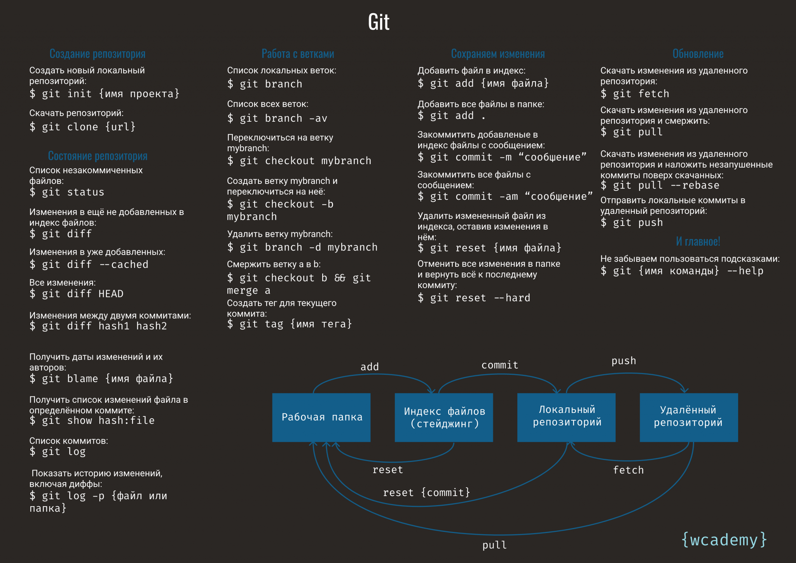

# Основы DevOps и DataOps | ЛБ 1 | Работа с Linux с использованием командной строки

**Дубровин Е.Н.**

МГТУ им. Н.Э. Баумана, 2026 г.

---

[TOC]

---

## Цель и задачи лабораторной работы

Цель лабораторной работы: Изучить принципы работы bash и git

Задачи лабораторной работы:

1. Создать рабочую директорию и файлы в ней при помощи bash и стандартных утилит Linux
2. Использовать основные утилиты Linux
3. Создать репозиторий git, выполнить коммиты в двух ветках их слияние с решением конфликтов

## Часть 1 | Команды bash и утилиты Linux

### Введение

Основной способ взаимодействия с сервером Linux - командная оболочка bash. Умение взаимодействовать с оболочкой является критичным для быстрого и качественного устранения проблем при развёртывания сервисов.

Можно описать взаимодействие с ОС следующей диаграммой:

```text
Оболочка (bash)
 v
ОС (Linux)
 |-> приложения: контейнеры и/или сервисы (systemd)
 | |-> конфиги <--- доставка
 | |-> код     <-╜
 | └-> логирование/журналирование
 |-> файловая система
 |-> сетевое взаимодействие
 └-> драйверное взаимодействие
```

В настоящей лабораторной работе будет в основном рассмотрена работа с файловой системой (ФС).

Прочие методы взаимодействия основываются на взаимодействия с ФС поскольку как правило настраиваются при помощи ФС и специализированных утилит.

Одним из важных принципов создания утилит в Linux является т.н. UNIX-way (подход UNIX): одна утилита должна осуществлять одно действие, но делать это хорошо.

### Работа с директориями и файлами

Для начала работы создадим директорию:

```bash
mkdir "[dirname]"
```

`[dirname]` следует задать соответствующим имени пользователя во внутренней системе МГТУ. Например, это имя пользователя используется при подключении к WIFI на территории МГТУ им. Н.Э. Баумана.

После создания директории, пользователю не будет возвращён никакой текстовый вывод, однако директория будет создана.

Linux является POSIX-операционной системой, и каждая вызываемая команда возвращает результат своего выполнения в виде целого числа. Например, возврат `0` обозначает нормальное завершение программы, `-1` - ошибочное завершение программы.

Посмотрим результат выполнения команды выше:

```bash
echo $?
```

Далее, следует изменить текущую директорию на созданную нами выше:

```bash
cd "[dirname]"
```

Будем далее называть эту директорию **рабочей директорией**.

При необходимости, можно переместиться выше:

```bash
cd ..
```

Стандартные пути `.` и `..` обозначают текущую директорию и директорию выше.

Создадим новый текстовый файл:

```bash
touch text.txt
```

И проверим содержимое директории:

```bash
ls
```

В результате выполнения команды выше будет выведено название файла `text.txt`.

Для редактирования файла можно воспользоваться утилитой nano, предоставляющей удобный интерфейс редактирования файлов в терминале:

```bash
nano text.txt
```

Вывод консоли будет очищен и на его месте будет отображён редактор nano. Редактор позволяет вводом с клавиатуры ввести содержимое файла. Для сохранения и закрытия файла следует использовать сочетания клавиш `CTRL+O`, `CTRL+Q`.

Введём содержимое файла:

```text
test
test1
test2
```

После закрытия редактора nano, текстовый вывод консоли, который был порождён ранее, будет возвращён на место.

Для просмотра содержимого файла не обязательно каждый раз открывать его в редакторе, можно использовать функцию отображения содержимого файлов:

```bash
cat text.txt
```

Будет выведено содержимого файла.

Вывод более длинных файлов помогут осуществить утилиты:

```bash
more text.txt 
less text.txt 
```

Утилита `more` позволяет вывести файл и начать его просмотр с начала. При этом будет замещать своим выводом предыдущий вывод в консоли.

Утилита `less` позволяет вывести файл и начать его просмотр как вверх, так и вниз. При этом не будет замещать предыдущий вывод в консоли.

Для поиска по ключевым  словам можно воспользоваться специальной утилитой:

```bash
grep 'test' text.txt
```

Очистим экран при помощи команды:

```bash
clear
```

При этом, история выполненных нами команд будет доступна:

```bash
history
```

### Базовая работа с процессами

Linux для каждой пользовательской сессии терминала подготавливает отдельную терминальную сессию. Уточнить текущую сессию можно при помощи команды:

```bash
tty
```

Текущие запущенные в рамках текущей терминальной сессии можно при помощи команды:

```bash
ps
```

Будет выведены только два текущих процесса: `bash` и `ps`.

Чтобы вывести все процессы, запущенные в ОС следует использовать утилиту:

```bash
pstree
```

Во вне-контейнерных ОС это приведёт к выводу большого числа процессов в иерархическом виде. Стоит обратить внимание что процессом, порождающем все остальные, в современных дистрибутивах ОС Linux является systemd.

Также можно ограничить вывод при помощи использования pipe передачи данных в bash:

```bash
pstree | more
pstree | less
```

Этот тип передачи данных позволяет перенаправить stdout (стандартного вывода) результатов выполнения одной утилиты в качестве stdin (стандартного ввода) следующей утилиты.

Также можно передавать результат работы (стандарты вывод) в файл:

```bash
echo test > text.txt
echo test >> text.txt
```

Первый и второй вариант отличаются тем, что `>` перезапишет файл, а `>>` добавит новую строчку в конец файла.

При помощи `<` можно передавать файлы в стандартный ввод программ.

Язык bash содержат также основные команды ветвления и циклов, например, в консоли в одной строке можно задать выражение, которое будет в цикле выводить счёт от 1 до 10 с ожиданием в 1 секунду:

```bash
for i in {1..10}; do sleep $i; echo $i; done
```

Виртуальный терминал позволяет создавать процессы на фоне, однако их вывод будет выводиться в этот же терминал.

Например, результат выполнения команды ниже будет мешать выполнять операции далее, но при их вводе они будут работать и выдавать свой результат:

```bash
for i in {1..10}; do sleep $i; echo $i; done &
```

Как видно, что для отправки процесса в фоновый режим, достаточно добавить амперсанд в конце строки.

Для возврата к процессу сохранённому на фоне следует использовать утилиту:

```bash
fg
```

Эта команда передаст управление из текущей сессии терминала, в запущенный на фоне процесс. В том числе, это позволит завершить его при помощи сочетания клавиш `CTRL+C`.

Однако, не следует путать отправку выполнения процесса на фон и отделение его от текущей сессии терминала.

В первом случае, при закрытии сессии терминала (закрытие терминального клиента, отключение от сессии ssh) процесс будет завершён.

Для отвязывания исполнения процесса от текущей терминальной сессии используются клиенты оконного режима: `screen/tmux`:

```bash
screen
```

Это переведёт в новое окно screen, содержащее подсказки об использовании приложения.

Следует нажать `Enter` и запустить скрипт подсчёта ещё раз.

Далее, при помощи сочетания клавиш `CTRL+a d` (в начале выполняется `CTRL+a` для перехода в режим передачи команд и далее, `d` для выполнения действия) можно покинуть текущую сессию screen.

Процесс останется в рабочем состоянии, при помощи команды `screen -x` можно подключиться обратно.

### Получение помощи по использованию утилит

Большинство утилит поставляются вместе с man-страницами (сокращение от слова manual, руководство пользователя) на разных языках, которые в подробностях рассказывают о назначении и возможных применениях утилит.

```bash
man screen
```

Также большинство утилит имеют краткую помощь, доступную при передаче флага `--help`:

```bash
screen --help
```

Флаги (задаются при помощи одного слова после `--` или одной буквы после `-`) могут весьма значительно влиять на поведение утилит.

Например, указание флага `-l` для утилиты `ls` позволит увидеть владельцев файлов, размеры файлов и даты их создания.

### Создание скриптов

Скриптом (или сценарием) называется файл, содержащий команды bash. Такие файлы можно сохранить и выполнять повторно.

Создадим файл `nano script.sh` со следующим содержимым:

```bash
#!/bin/bash

for i in {1..10}
do
    echo $i
done
```

Первая строка файла является указанием на используемый интерпретатор (нам это потребуется далее), остальные - циклом, который мы описывали выше, но в развёрнутом виде.

Скрипт можно выполнить при помощи запуска непосредственно в интерпретаторе:

```bash
bash script.sh
```

Однако, такой способ не удобен для написания собственных утилит (~60% утилит Linux на самом деле являются скриптами). Для решения этой проблемы мы написали используемый интерпретатор в начале файла, однако на данный момент воспользоваться им невозможно, файл не доступен для запуска.

Доступ на запуск файла является частью системы Linux по управлению правами. Она состоит из 3 групп прав и 3 видов прав.

```text
Владелец | Группа владельцев | Прочие
   rwx            rwx           rwx
```

Владелец, это тот пользователь, который владеет файлом, для его изменения можно воспользоваться функцией (не следует это делать в рамках проведения ЛБ):

```bash
chown "[user]" script.sh
```

А узнать текущее имя пользователя можно при помощи утилиты:

```bash
whoami
```

Группа владельцев определяется схожим образу владельцев, но это группа Linux, в которую может входить множество пользователей.

Прочие - все пользователи, не попадающие под две предыдущие категории.

Права задаются при помощи следующего формата:

* `r` - число 4 - право на чтение файла
* `w` - число 2 - право на запись в файл
* `x` - число 1 - право на исполнение файла

Каждое из соответствий чисел `rwx` позволяют в стиле бинарного файла определить его цифровое значение.

Например, право `r`, `w` будет иметь число 6, а `r`, `w`, `x` - 7.

Три таких числа будут задавать полные права на файл.

Чаще всего встречаются сочетания 644, 664, 744.

Изменить права на файл можно следующим образом:

```bash
chmod +x script.sh
```

Выполнение такой команды даст право всем пользователям исполнять этот файл.

Утилита `chmod` также принимает формат цифровой задачи прав.

Теперь мы можем вызвать скрипт из текущей директории:

```bash
./script.sh
```

### Работа с переменными и переменными окружения

Язык bash предполагает задание переменных без пробела:

```bash
a=5
b=6
```

Эти переменные можно использовать в выражениях bash в текущем терминале:

```bash
echo $a+$b
echo $(($a+$b))
```

Две строчки выше отличаются интерпретацией переменных.

Первая строчка - стандартный режим bash, который расценивает содержимое любых переменных как текст.

Вторая строчка - математический режим bash, где числа преобразуются в целые, в результате доступны математические функции.

Изменим текст `script.sh`:

```bash
#!/bin/bash

for i in {1..10}
do
    echo ${a}+${b}
done
```

Выполнив команду `./script.sh` вместо значения переменных мы получим пустые строчки, поскольку незаданные переменные в bash интерпретируются как пустые строки и не приводят к ошибкам.

Однако, если мы выполним скрипт в одном из форматов ниже:

```bash
. script.sh
# или
source script.sh
```

Получим ожидаемый результат.

Команда выполнения скрипта в текущей директории (`source`, можно сократить до указания текущей директории) выполнит скрипт без запуска дополнительного процесса bash, в рамках текущего процесса, что и даст доступ к переменным.

Однако, можно дать доступ к переменным из-вне, экспортировав эти переменные в переменные окружения:

```bash
export a=5
export b=6
```

Теперь выполнение `./script.sh` покажет ожидаемый результат.

Все текущие переменные окружения можно получить при помощи команды:

```bash
env
```

### Базовое сетевое взаимодействие

Для получения настроек сетевых интерфейсов следует использовать утилиту:

```bash
ip addr show
```

Для выполнения пинга (т.е. проверки доступности) удалённого сервиса следует использовать утилиту:

```bash
ping ya.ru
```

Чтобы узнать ip адреса, соответствущие доменному имени, следует использовать утилиту:

```bash
host ya.ru
```

Чтобы выполнить запрос к удалённому сервису, следует использовать утилиту:

```bash
curl ya.ru
```

### Задание 1 | Команды bash и утилиты Linux

Следует описать назначение и использование команды bash или утилиты Linux по варианту из таблицы ниже:

| №  | Утилита | | №  | Утилита    | | №  | Утилита  |
| -- | ------- |-| -- | ---------- |-| -- | -------- |
|  1 | mkdir   | | 10 | ps         | | 19 | tty      |
|  2 | echo    | | 11 | pstree     | | 20 | screen   |
|  3 | touch   | | 12 | man        | | 21 | chmod    |
|  4 | cat     | | 13 | ls         | | 22 | chown    |
|  5 | nano    | | 14 | cd         | | 23 | whoami   |
|  6 | sleep   | | 15 | ping       | | 24 | env      |
|  7 | clear   | | 16 | host       | | 25 | export   |
|  8 | less    | | 17 | source     | | 26 | curl     |
|  9 | more    | | 18 | fg         | | 27 | grep     |

### Задание 2 | Автоматизация создания директорий и файлов

Задание:

* Создать 100 директорий `foo00..foo99`
* В каждой из директорий создать 100 текстовых файлов `bar00..bar99`
* В каждом файле написать 100 строк `test00..test99`

В отчёте следует указать итоговый скрипт создания файлов и добавить текстовое описание его работы.

## Часть 2 | Система контроля версий Git [1]

### Описание и начало работы

Система контроля версия Git предназначена для обеспечения сохранения истории изменений текстовых файлов и их синхронизацию с удалёнными хранилищами.

Для начала работы следует установить git:

```bash
# Ubuntu / Debian / WSL / ALT Linux
sudo apt install git

# MacOS
brew install git
```

Далее, в рабочей директории следует инициализировать git репозиторий:

```bash
git init
```

Это создаст директорию `.git`, которая будет содержать системные файлы репозитория.

Репозиторий состоит из рабочей директории (актуальной версии файлов, с которой работает пользователь) и системной директории `.git` - она собственно и является репозиторием.

Для рассматриваемого примера:

```text
Директория:
  |
  |--> script.sh -----> Рабочая директория (working tree)
  |--> text.txt  ---̍̍̍̍
  └--> .git      -----> Репозиторий
```

В эти файлы входят:

* Объекты хранимых файлов в текущей (крайней) версии
* Дельты разницы с предыдущими версиями файлов
* Указатели на текущее состояние рабочей директории

#### Удалённые репозитории

При организации репозиториев, доступных удалённо (например, в GitHub или GitLab), необходимости в рабочей директории нет (некому в ней работать), поэтому используют bare-репозитории (не содержащие рабочую директорию). Содержимое bare-репозитория - это содержимое `.git` директории. Именно поэтому такие удалённые хранилища и называют репозиториями, а ссылки на них, как правило, заканчиваются на `.git`. Например, ссылка на репозиторий настоящих методических указаний `https://gitlab.bmstu.ru/devops-dataops-intro/labs/lab-1-bash.git` - по ней можно получить всё содержимое `.git` директории - репозиторий.

#### Git Diff

Принцип работы git основывается на расчёте разницы файлов по разделителю `\n` (git diff), которая определяет разницу между 2 или большим числом файлов на основе переносов строк (символов `\n`).

Именно по этой причине в git не рекомендуется хранить бинарные файлы. Бинарные файлы не содержат переносы строк и поэтому при внесении любого изменения новая версия будет целиком перезаписывать новую.

Например, docx файл будет целиком изменяться при каждом сохранении (даже если не было произведено модификации файла), поскольку в бинарном виде содержит запись о дате и времени последнего сохранения.

Такая же проблема преследует минифицированные (обфусцированные) файлы, где все токены (переменные, функции, выражения) объединены в одну строку без переносов. В таком случае git diff по умолчанию показывает малополезный результат, так как не видит различий внутри токенов.

Однако, у каждого правила бывают исключения. В репозитории, использованном для хранения этих методических указаний, хранится бинарный файл `git-cheat-sheet.png`. Этот файл был изменён лишь единожды, при его создании, и используется для вставки ниже в текст методических указаний.

### Линейная история коммитов

#### Фиксация изменений в индексе

После создания репозитория можно сразу же зафиксировать текущее состояние рабочей директории в индексе git:

```bash
git add .
```

Данная команда приведёт к расчёту изменений текущей рабочей директории относительно предыдущего коммита.

Поскольку у нас нет предыдущего коммита, это изменение будет пустым.

Этот расчёт не приведёт к фиксации изменений в репозитории (коммиту).

#### Первый коммит [1]

Чтобы создать коммит следует ввести команду:

```bash
git commit
```

Эта команда откроет выбранный текстовый редактор для редактирования файла, содержащего коммит-сообщение.

Коммит сообщение - это текстовое описание внесённых изменений, предназначенное для человека. Эти сообщения выводятся при просмотре истории изменения репозитория.

Редактор для коммита можно поменять командой:

```bash
git config --global core.editor nano
```

#### Фиксация пользователя git

Однако, если git запускается в первый раз и не был настроен, то будет выведено сообщение о необходимости настройки git:

```bash
git config --global user.name "[имя]"
git config --global user.email "[адрес электронной почты]"
```

Команды выше установят имя пользователя git (предполагается использовать реальное имя) и его адрес электронной почты.

Для работы во многих системах, использующих git (GitHub, GitLab), следует помнить - **связывание автора изменения и пользователя системы, сделавших их, выполняется на основе адреса электронной почты**. Следует везде использовать одинаковый адрес электронной почты. В системах GitHub и GitLab можно указывать несколько адресов электронной почты.

#### Первый коммит [2]

Также коммит сообщение можно создать без открытия редактора:

```bash
git commit -m "[коммит сообщение]"
```

После создания первого коммита, выполним команду для просмотра истории изменений:

```bash
git log
```

Вывод команды просмотра будет иметь вид:

```text
commit 3d93a9b3a3a37e1ff2161c4153f5665ea7874bc0
Author: Egor Dubrovin <dubrovin.en@ya.ru>
Date:   Fri Sep 6 19:50:14 2024 +0300

    Первый коммит
```

Где `3d93a9b3a3a37e1ff2161c4153f5665ea7874bc0` - sha256 хеш-сумма коммита, она является уникальным идентификатором сохранённого состояния рабочей директории для этого коммита.

К каждому коммиту можно вернуться при помощи команды:

```bash
git checkout "[хеш-сумма коммита]"
```

Хеш сумма внутри одного репозитория также может быть записана в сокращённом виде: достаточно 7-10 первых символов для уникальной идентификации коммита в рамках одного репозитория. Нет явных ограничений на длину этого префикса, достаточно чтобы он был уникален.

Например записи `git show 3d93a9b3a` и `git show 3d93a9b3a3a37e1ff2161c4153f5665ea7874bc0` эквивалентны.

#### Второй коммит

Изменим файл `text.txt`, пусть его содержимое теперь будет:

```text
test
test1
test2
test3
```

Как видно, была добавлена строка `test3`. Отличие текущего состояния файла и последнего сохранённого коммита можно выполнить при помощи функции:

```bash
git diff
```

Зафиксируем и эти изменения:

```bash
git commit -a -m "Второй коммит"
```

В команде выше был использован флаг `-a`, который автоматически добавляет к индексу изменённые файлы. **Этот флаг однако не добавляет к индексу новые файлы и не удаляет файлы**.

### Просмотр графа истории

Очень мощным инструментом при работе с git является визуализация. Текущая последовательность коммитов довольно тривиальна, и может быть отображена как `A -> B`.

Уточним что под `А` подразумевается первый коммит, а под `B` - второй.

Аналогичный граф последовательности коммитов можно вывести при помощи самого git:

```bash
git log --graph
```

При помощи флага `--oneline` можно также вывести коммит в однострочном формате. Для двух последовательных коммитов в таком отображении не будет выведена линия связывания их, вывод будет иметь вид:

```text
* be8529f Второй коммит
* 4124422 Первый коммит
```

Флаг `--shortstat` покажет также краткий список изменённых файлов в коммите. Более подробную информацию можно получить при помощи флага `--stat`. Флаг `--all` покажет все ветки репозитория. Флаг `--decorate` укажет на состояние веток в удалённом репозитории. **Эти флаги пригодиться при подготовке отчёта по ЛР**.

### Работа с удалённым репозиторием

Существует множество сервисов, которые позволяют распространять и работать с удалёнными репозиториями. Например, GitLab - платформа для управления git репозиториями и множеством прочих DevOps операций - будет предметом рассмотрения 4 ЛР.

Для упрощения рассмотрим наиболее простой случай работы с удалённым репозиторием: директорию в той же файловой системе. В действительности, работа с такой директорией не отличается ничем по сравнению с работой в GitHub или GitLab.

Репозиторий в рабочей директории, который мы рассматривали до этого момента, будем здесь и далее называть *локальным клоном репозитория* или *локальным репозиторием*.

#### Подготовка удалённого репозитория

Следует учитывать важную особенность работы в случае настоящей ЛР. Удалённый репозиторий обязан не иметь заранее созданных коммитов - иначе без разрешения конфликтов (о чём ниже) невозможно будет выложить в него существующую историю локального репозитория.

Замечание выше очень важно при работе с сервисами GitHub или GitLab - эти сервисы очень настойчиво предлагают создать первый коммит вместе с инициализацией репозитория.

Выполним действия по инициализации удалённого репозитория:

```bash
# Перейдём выше текущей рабочей директории
cd ..

# Создадим директорию удалённого репозитория
mkdir myfirstrepo.git
cd myfirstrepo.git

# Инициализируем репозиторий
git init --bare
```

Команда `git log` должна вывести сообщение `fatal: your current branch 'main' does not have any commits yet` - а значит мы корректно инициализировали удалённый репозиторий без коммитов.

‼️ Для выполнения дальнейших действий удобно будет открыть два экземпляра терминала: один в локальном репозитория, а второй - в удалённом

#### Выполнение пуша изменений в удалённый репозиторий

В локальном репозитории следует выполнить команду для добавления удалённого репозитория:

```bash
git remote add origin ../myfirstrepo.git
```

В команде, показанной выше, `origin` - это название удалённого репозитория, по-умолчанию, такое название имеет удалённый репозиторий, из которого склонирован локальный репозиторий. Мы добавим такое название для упрощения, `origin` - наиболее распространённое название.

Посмотреть все доступные удалённые репозитории можно командой `git remote -v`. Флаг `-v` отвечает за вывод подробной информации, которая включает полный адрес и режим доступа - передачу информации в удалённый репозиторий (`push`, пуш) и на получение информации из удалённого репозитория (`fetch`).

Пуш в удалённый репозиторий выполняется командой ниже:

```bash
git push origin main
```

При выполнении этой команды можно указать флаг `--set-upstream`, который запомнит сочетание удалённого репозитория `origin` и ветки `main` по-умолчанию. В ветке main таким образом будет достаточно выполнить `git push` для пуша в удалённый репозиторий.

В удалённом репозитории граф истории коммитов должен иметь в точности тот же вид, что в локальном репозитории.

#### Клонирование удалённого репозитория

Как правило, работа с удалённым репозиторием начинается с его создания, затем клонирования в локальную копию с рабочей директорией. Выше мы поступили в противоположном порядке.

Для клонирования репозитория следует выполнить команду из директории, родительской к удалённому репозиторию (из локального репозитория следует выполнить команду `cd ..`):

```bash
git clone myfirstrepo.git

cd myfirstrepo
```

Команда `git clone` клонирует удалённый репозиторий, создаст из версии крайнего коммита (второго коммита в нашем случае) рабочую директорию.

Зайдём в рабочую директорию нового репозитория (следует заметить, что она называется `myfirstrepo`, без суффикса `.git`), проверим наличие всех коммитов и удалённые репозитории.

```bash
git log --graph --oneline --stat

git remote -v
```

### Обновление локального репозитория данными из удалённого репозитория

Получить новые коммиты из нового репозитория можно командой:

```bash
git pull origin main
```

Также как для `git push`, в случае использования `--set-upstream`, `git pull` запомнит связку origin main для получения данных из удалённого репозитория.

В действительности, `git pull` полностью аналогичен двум командам:

```bash
git fetch origin main

git merge origin/main
```

Команду `git merge` мы разберём ниже при рассмотрении нелинейной работы в git. Следует также заметить, обозначение `origin/main` - это обозначение копии ветки `main`, которая получена из удалённого репозитория `origin`, которая, однако, не обязана совпадать с веткой `main` локального репозитория.

Для команды `git pull` в действительности есть несколько флагов, например, `--rebase`, которые заменяют вторую команду в аналоге на `git rebase origin/main`. Команду `git rebase` мы также разберём ниже.

## Задание 3 | Работа с удалённым репозиторием Git

Внесите любое изменение в один из двух файлов в рабочей директории нового склонированного репозитория, затем выложите эти изменения в удалённый репозиторий, и получите их в старом локальном репозитории.

Все выполненные команды, а также граф коммитов удалённого репозитория (с указанием флагов `--oneline --stat`) отразить в отчёте.

## Часть 2 | Система контроля версий Git [2]

### Нелинейная истории коммитов

Нелинейная работа в git, как правило, ассоциируется с работой в команде. Большинство практических советов ниже будут касаться именно этого случая.

Главная возможность нелинейной работы в git - использование ответвлений в репозиториях.

Общая схема следующая:

* Для синхронизации работы используется единый удалённый репозиторий (например, в сервисах GitHub или GitLab)
* Несколько разработчиков работают в разных ветках
* Слияние веток производится в удалённом репозитории в сервисе
* Следует стараться избегать конфликтов в ветах, однако механизмы git позволяют их удобно разрешать в ручном режиме

Разумеется, на эту схему накладываются различные особенности устройства конкретной команды разработки и используемых ими инструментов и подходов (GitFlow, GitLabFlow и т.п.).

#### Ветки репозитория

Дальнейшую работу следует вести в одном из локальных репозиториев.

Текущие ветки репозитория можно получить при помощи команды:

```bash
git branch
```

Это выведет текущую единственную ветку `main` - создаваемую по-умолчанию при создании репозитория. Текущая (выбранная ветка) помечается символом `*`.

Сделаем ответвление от текущей ветки:

```bash
git checkout -b test
```

Эта команда создаст и переключится в ветку `test` (аналогично команде возврата к коммиту по хеш-сумме). Название ветки - это суть файл в директории `.git` с указанием "головного" (т.е. самого крайнего) коммита этой ветки. Указатель в терминологии git.

Аналогичного результата можно добиться парой команд:

```bash
# Создать ветку
git branch test

# Переключиться на ветку
git checkout test
```

#### Изменения в файле в ветке test

Изменим файл `text.txt` в новой ветке:

```text
test
test1
testj
test3
```

Выполним коммит внесённых изменений.

Теперь описать состояние дерева коммитов можно следующей диаграммой. Коммит C отражён как результат выполнения [задания 3](#задание-3--работа-с-удалённым-репозиторием-git).

```text
A -> B -> C (main)
           \-> D (test)
```

#### Изменения в файле в ветке main

Вернёмся в ветку `main`:

```bash
git checkout main
```

В рабочей директории будет возвращено состояние, соответствующее предыдущему коммиту.

При этом будет переключён указатель `HEAD`, предназначенный для сохранения текущего коммита, которому соответствует рабочая директория.

Выполним симуляцию "плохой" совместной работы в git, внесём изменения в ветке `main`, которые порождают конфликт с веткой `test`.

Файл `text.txt` должен содержать строчки:

```text
test
test1
testi
test3
```

После коммита, граф будет иметь следующий вид:

```text
A -> B -> C -> E (main)
           \-> D (test)
```

#### Слияние веток с конфликтом

Как видно, третьи строчки файла не позволят в автоматическом режиме без вмешательства объединить эти файлы в один. Автоматически хорошо разрешаются конфликты, которые затрагивают разные строчки или добавляют строчки.

Выполним попытку слияния веток:

```bash
git merge test
```

Команда выше попытается выполнить автоматическое слияние ветки test в ветку main так чтобы получить единую историю коммитов.

Однако, в связи с внесёнными изменениями, это окажется невозможным, в результате git предложит исправить конфликты в ручном режиме.

#### Разрешение конфликта

Исправление следует выполнить в рабочей директории (то есть все конфликты будут отражены в реальных файлах) и затем выполнить фиксацию в индексе и коммит результата. Файл `text.txt` будет иметь вид:

```text
test
test1
<<<<<<< HEAD
testi
=======
testj
>>>>>>> test
```

Верхняя строчка, обозначенная как `<<<<<<< HEAD` и до `=======` соответствует той версии файла, что была в ветке main (текущее состояние).

Нижняя строчка, обозначенная как `>>>>>>> test` и после `=======` соответствует версии файла из ветки test (приходящие изменения).

Следует выбрать одну из строк, удалить лишнюю строку, а также обозначения `<<<<<<< HEAD`, `=======`, `>>>>>>> test`, относящиеся к разрешению конфликта слияния.

#### Окончание слияния

После выполнения коммита будет сохранен коммит, выполняющий слияние двух веток вместе. Граф будет иметь вид:

```text
A -> B -> C -> E -> F (main)
           \-> D - / (test)
```

Следует обратить внимание, что ветка test всё ещё будет указывать на коммит D, перемещена будет только ветка D.

### Отмена изменений в git

Система контроля версий git обладает крайней высокой гибкостью, она буквально позволят "изменять историю". Все дальнейшие примеры будут посвящены этой теме.

Однако, при редактировании уже сделанных коммитов, следует быть осторожным - всегда есть шанс потерять те или иные изменения. С другой стороны, наличие удалённого репозитория с сохранённой "неудобной" историей коммитов позволит всегда начать с чистого листа.

#### Пуш двух веток в удалённый репозиторий

Воспользуемся этой возможностью для локального репозитория:

```bash
# Пуш ветки main
git push origin main

# Независимый пуш ветки test
git push origin test
```

#### Цель отмены изменений

Также важно представлять цель выполняемых команд. Для выполнения дальнейших экспериментов мы хотим убрать два предыдущих коммита в ветке `main`.

Другими словами, перейти от графа вида:

```text
A -> B -> C -> E -> F (main)
           \-> D - / (test)
```

К графу вида:

```text
A -> B -> C (main)
           \-> D (test)
```

#### Отмена изменений

Для отмены уже "закомиченных" изменений с откатом к соответствующей версии следует использовать команду:

```bash
git reset --hard HEAD~2
```

Здесь следует заметить указание `HEAD~2` - оно обозначает "два коммита назад от указателя `HEAD`". Указатель `HEAD` содержит крайний на текущий момент коммит.

Поскольку мы находимся в ветке main, аналогичный результаты мы могли бы получить, выполнив команду `main~2` или указав хеш (достаточное количество символов для его идентификации) коммита.

Флаг `--hard` указывает на "жёсткое" переписывания рабочей директории и индекса в соответствии с указанным коммитом. Такое поведение не распространяется на новые файлы в директории.

Ниже мы найдём применение ещё одному флагу команды `git reset`, `--soft`.

### Силовой пуш в удалённый репозиторий

Если сравнить графы коммитов в локальном и удалённых репозиториях, легко убедиться что они не соответствуют друг другу.

Для силовой синхронизации локального репозитория с удалённым следует использовать команду в локальном репозитории:

```bash
git push origin main --force
```

Для "силовой" выгрузки изменений из удалённого репозитория в локальный следует выполнить:

```bash
git pull origin main --rebase
```

Слово силовой взято в кавычки поскольку это формально некорректно, мы выгружаем ветку локально и затем "пересаживаем отличающиеся изменения", что может закончится конфликтами. Git старается всеми силами не потерять изменения пользователя.

### Быстрое слияние веток

Представим, что коммит `D` из ветки `test` устроил нас, конфликтов с веткой `main` нет (мы внесли только одно изменение) и нам хочется чтобы этот коммит стал частью истории ветки `main`.

Для выполнения этого желания требуется просто ввести команду `git merge test` находясь в этот момент в ветке `main`.

Граф приобретёт вид:

```text
A -> B -> C -> D (test, main)
```

Функционально указатель `main` просто перепрыгнет на следующий коммит `D`. Линейность истории будет сохранена, а ветка `test` сравняется с веткой `main`.

В терминологии git такое слияние называется быстрым (`fast-forwarding`).

В случае, когда надо обязать гит провести только такое слияние, или не проводить слияние вовсе, следует указать флаг `--ff-only` - в таком случае, при невозможности провести быстрое слияние, будет выведена ошибка.

#### Подготовка к альтернативному слиянию

Для дальнейших экспериментов, следует вернуть граф коммитов к предыдущему виду, выполнить команду:

```bash
# Альтернатива 1 - локально откатить main
git reset --hard main~1

# Альтернатива 2 - силовым образом синхронизироваться с удалённым репозиторием
git pull origin main --rebase
```

### Слияние веток с третьим коммитом

Иногда следует, даже при возможности быстрого слияния, строго от него отказаться - выполнить слияние с третьим коммитом.

Третий коммит называется так поскольку появляется в результате формального объединения двух прародителей - крайнего коммита текущей ветки и крайнего коммита ветки с которой выполняется слияния.

Слияние веток с третьим коммитом часто является основной тех или иных подходов к использованию git в командной разработке (GitFlow, GitlabFlow и т.д.). Такая необходимость возникает при необходимости сохранения отдельной истории изменения веток между собой. Цель этой необходимости может быть разной, например - сохранение авторских веток при общем main.

Слияние веток с третьим коммитом должна привести граф к виду:

```text
A -> B -> C -----> E (main)
           \-> D -/ (test)
```

Другими словами, следует получить "комбинированный" коммит `E` с двумя родителями `C` и `D`.

Следует также обратить внимание, что коммит `E` будет создан в ветке `main`, ветке, в которой выполняется слияние.

Выполнение слияния с третьим коммитом:

```bash
git merge test --no-ff
```

После этого откроется редактор для фиксации сообщения третьего (`E`) коммита. Следует изменить или оставить текст по-умолчанию, сохранить его - третий коммит будет завершён.

### Изменение крайнего коммита

Для начала работы в этом разделе следует иметь локальный репозиторий в виде:

```text
A -> B -> C (main)
           \-> D (test)
```

‼️ Следует находиться в ветке `test`!

Регулярно разработчики "накапливают" критическую массу изменений в крайнем коммите. Такой коммит может публиковаться в удалённом репозитории или быть просто локальной точкой сохранения.

Наивно можно все самые малые изменения оформлять как отдельные коммиты, однако довольно быстро появится целый набор проблем:

1. Таких коммитов слишком много
2. Такие коммиты содержат слишком малые и слишком разрозненные между друг другом изменения чтобы рассматривать их отдельно друг от друга - они являются единым целым
3. Очень быстро заканчивается внятные сообщения коммитов - формулировка "исправление проблемы, которая была выявлена 3 коммита назад" - верный признак что этого коммита просто не должно было существовать

Золотое правило гласит - "Коммит должен иметь чёткую причину изменений и содержать версию, к которой можно вернуться". Это правило в действительности нарушается довольно часто, но к нему стоит стремиться.

Итак, в случае если следует добавить изменения рабочей директории в **крайний коммит** ветки, следует выполнить команду:

```bash
# Следует помнить что флаг `-a` не распространяется на новые файлы
git commit -a --amend
```

Эта команда приведёт к открытию редактора, где можно изменить сообщение крайнего коммита. Флаг `--no-edit` укажет git, что изменение сообщения коммита не требуется.

### Перебазирование коммитов

Перебазирование коммитов - `rebase` - это мощный инструмент для очистки истории коммитов без необходимости выполнять лишние слияния с третьим коммитом.

Необходимость в выполнении этой команды часто возникает при долгой работе над изменением в отдельной ветке, когда в основной ветке `main` уже появились более свежие изменения.

Представим ситуацию, которая описывается графом:

```text
A -> B -> C -> F (main)
           \-> D -> E (test)
```

Эта ситуация напоминает ситуацию "нехорошего" слияния, котору мы проводили выше.

Допустим, однако, что нам надо продолжить работу в ветке `test`, коммит же `F` представляет собой особенно важный патч безопасности.

Можно выполнить слияние вида:

```text
A -> B -> C -> F --------\ (main)
           \-> D -> E -> G (test)
```

Такой вид слияние ничем не плох, однако, допустим, мы хотим организовать репозиторий без слияний с веткой main из прочих веток, то есть преобразовать граф к виду:

```text
A -> B -> C -> F (main)
                \-> D -> E (test)
```

Для этого, находясь в вете `test` следует выполнить команду

```bash
git rebase main
```

Эта команда выполнит перерасчёт дельт изменений коммитов `D` и `E` относительно разницы между коммитами `C` и `F`. Затем вся история коммитов будет применена как показано на графе.

#### Перебазирование коммитов с конфликтами

Особым случаем является наличие конфликтов при выполнении такого перебазирования.

В качестве примера, вернёмся к разнице между файлами из пункта [о разрешении конфликтов слияния](#слияние-веток-с-конфликтом).

Возникновение конфликтов при перебазировании коммитов приведёт к формировании файлов для ручного разрешения конфликтов в рабочей директории.

После разрешения конфликтов, их следует добавить в индекс `git add .`, а затем продолжить перебазирование `git rebase main --continue`.

### Изменение и/или объединение множества коммитов

Представим ситуацию, описываемую графом:

```text
A -> B -> C (main)
           \-> D -> E -> F -> G (test)
```

‼️ Следует находиться в ветке `test`!

Допустим, что коммит `D` был сделан осознанно, однако текст его сообщения коммита нас не удовлетворяет.

Коммиты `E`, `F`, `G` следует объединить, разработчик использовал их как свою "записную книжку".

Для выполнения таких операций потребуется воспользоваться интерактивным перебазированием (rebase). Суть довольно проста - в интерактивном режиме можно внести все необходимые изменения, на основе которых будут созданы новые коммиты (с новыми хешами). Эти изменения будут представлены виртуальной веткой, на которую будет перебазирована ветка `test`.

Для выполнения интерактивного перебазирования следует чётко определить корень этого перебазирования. Корень будет общим коммитом между текущей веткой и новой виртуальной веткой. Именно поэтому он не будет представлен в окне интерактивного перебазирования.

Для выполнения интерактивного перебазирования всех коммитов за всю историю следует использовать флаг `--root`.

В нашем случае, нас интересует модификация коммитов `D`, `E`, `F`, `G`, корень перебазирования должен быть коммит `C`.

Следует выполнить:

```bash
git rebase -i HEAD~4 # Эквивалентно указанию хеша коммита C или main
```

Будет открыт редактор планировщика интерактивного перебазирования:

```text
pick <хеш коммита D> # Коммит D
pick <хеш коммита E> # Коммит E
pick <хеш коммита F> # Коммит F
pick <хеш коммита G> # Коммит G

# Rebase <хеш коммита G> onto <хеш коммита C> (4 commands)
#
# Commands:
# p, pick <commit> = use commit
# r, reword <commit> = use commit, but edit the commit message
# e, edit <commit> = use commit, but stop for amending
# s, squash <commit> = use commit, but meld into previous commit
# f, fixup [-C | -c] <commit> = like "squash" but keep only the previous
#                    commit's log message, unless -C is used, in which case
#                    keep only this commit's message; -c is same as -C but
#                    opens the editor
# x, exec <command> = run command (the rest of the line) using shell
# b, break = stop here (continue rebase later with 'git rebase --continue')
# d, drop <commit> = remove commit
# l, label <label> = label current HEAD with a name
# t, reset <label> = reset HEAD to a label
# m, merge [-C <commit> | -c <commit>] <label> [# <oneline>]
#         create a merge commit using the original merge commit's
#         message (or the oneline, if no original merge commit was
#         specified); use -c <commit> to reword the commit message
# u, update-ref <ref> = track a placeholder for the <ref> to be updated
#                       to this position in the new commits. The <ref> is
#                       updated at the end of the rebase
#
# These lines can be re-ordered; they are executed from top to bottom.
#
# If you remove a line here THAT COMMIT WILL BE LOST.
#
# However, if you remove everything, the rebase will be aborted.
#
```

Редактор содержит подробную помощь по осуществлению интерактивного перебазирования. В нашем случае, на интересует лишь три команды:

* `p, pick <commit>` - Оставить коммит, буквально "ничего не делать"
* `r, reword <commit>` - Изменить сообщение коммита
* `s, squash <commit>` - "Сплющить" коммит с предыдущим

Для последней команды `squash` обязательно чтобы существовал коммит выше, к которому прибавятся дельты "сплющиваемого" коммита.

Для нашего случая окно команд должно иметь вид:

```text
r <хеш коммита D> # Коммит D
pick <хеш коммита E> # Коммит E
s <хеш коммита F> # Коммит F
s <хеш коммита G> # Коммит G
```

Стоит обратить внимание на возможность писать всего одно букву для указания команды над коммитом. Также стоит обратить внимания что коммит `E` берётся без изменений - он будет базой для "сплющивания" к нему коммитов `F` и `G`.

После сохранения файла команд интерактивного перебазирования, будет последовательно открыто:

* Окно редактирования сообщения коммита `D`
* Окно редактирования коммита для объединённых коммитов `E`, `F` и `G`

Второе окно редактирования будет иметь вид:

```text
# This is a combination of 3 commits.
# This is the 1st commit message:

Коммит E

# This is the commit message #2:

Коммит F

# This is the commit message #3:

Коммит G

# Please enter the commit message for your changes. Lines starting
# with '#' will be ignored, and an empty message aborts the commit.
```

Здесь будут перечисленны сообщения коммита для всех трёх коммитов. Часто требуется сообщения коммитов для всех трёх коммитов, но написать один общий. В таком случае, достаточно закомментировать сообщения коммитов (поставить в начале строки символ `#`) и написать новое сообщение коммита в отдельной строке. Все строки, начинающиеся с символа `#` будут проигнорированы.

Итоговый граф будет иметь вид:

```text
A -> B -> C (main)
           \-> D -> EFG (test)
```

Где у коммита `D` будет новое сообщение коммита, а `EFG` будет комбинацией всех изменений коммитов `E`, `F` и `G`.

### Теги

Теги являются инструментом указывания на конкретный коммит (крайний на данный момент). Часто их применяют для указания на конкретные версии разработки, также часто они становятся сущностью-инициатором CI/CD процессов.

Для создания тега следует выполнить команду:

```bash
git tag v1.0.0
```

`v1.0.0` в этом примере название тега, может быть любой строкой.

Теги автоматически не следят за изменениями в прочих ветках, они указывают на хеш именно тот, с которым они были созданы.

Допустим, в начальный момент был граф (`v1.0.0` указывает на коммит `E`):

```text
A -> B -> C -> F (main)
           \-> D -> E (test)
                 (v1.0.0)
```

То после выполнения из ветки `test` команды `git rebase main`, граф будет иметь вид:

```text
A -> B -> C -> F (main)
          |     \-> D -> E (test)
           \-> D* -> E*
                 (v1.0.0)
```

Другими словами, тег `v1.0.0` не изменит своего положения, будет указывать на **старый** коммит E (в графе помечен как `E*`).

Для перемещения тега между коммитами следует использовать флаг `--force`.

Следует крайне внимательно следить за тегами и их историей, для удаления тега можно воспользоваться командой: `git tag -d v1.0.0`.

### Шпаргалка по всем командам git

Ниже на изображении приведена шпаргалка по основным командам git. Очень полезным является правая нижняя часть изображения, здесь отображается граф состояний файлов в git и команды для перемещения их между состояниями.



### Задание 4 | Нелинейная работа с Git

Следует построить указанные для чётных и нечётных вариантов последовательности состояний репозитория git.

В отчёте следует отразить основные действия, которые потребовалось выполнить для перехода между состояниями

Все воспроизведённые состояния следует отразить в отчёте применяя команду `git log` с флагами `--oneline`, `--stats`, `--all`, `--decorate`.

#### Задание для чётных вариантов

```text
A -> B (main)
```

```text
# Следует удалить коммит B
A (main)
```

```text
  (v1.0.0 - тег коммита C)
A -> C (main)
 \ -> D (feature)
```

```text
  (v1.0.0)  (v1.1.0 - тег коммита E)
A -> C -----> E (main)
 \ -> D -----/    (feature)
```

```text
  (v1.0.0)  (v1.1.0)
A -> C -----> E (main)
 \ -> D -----/---> F -> G -> H (feature)
                           (v1.1.1-fix.0 - тег коммита H)
```

```text
# Коммиты F, G, H слить вместе в FGH

  (v1.0.0)  (v1.1.0)
A -> C -----> E -> I (main)
 \ -> D -----/---> FGH (feature)
                (v1.1.1-fix.0 - тег коммита FGH)
```

```text
# Коммиты F, G, H слить вместе в FGH

  (v1.0.0)  (v1.1.0)
A -> C -----> E -> I -----> J (main)
 \ -> D -----/---> FGH ----/ (feature)
                (v1.1.1-fix.0 - тег коммита FGH)
```

#### Задание для нечётных вариантов

```text
A -> B (main)
```

```text
# Объединить коммиты A и B

AB (main)
```

```text
(v1.0.0 - тег коммита AB)
AB (main)
```

```text
AB (main)
 \--> C (feature)
   (v1.0.0 - тег коммита C)
```

```text
    (v1.0.0)
AB -> C (main, feature)
```

```text
    (v1.0.0)
AB -> C (main)
       \--> D -> E (feature)
```

```text
    (v1.0.0)       (v1.1.0 - тег коммита F)
AB -> C -----------> F (main)
       \--> D -> E -/ (feature)
```

```text
# Объединить коммиты D и E

    (v1.0.0)   (v1.1.0)
AB -> C --------> F (main)
       \--> DE --/ (feature)
```

## Содержание отчёта

1. [`Цель и задачи лабораторной работы`](#цель-и-задачи-лабораторной-работы)

2. [`Задание 1 | Команды bash и утилиты Linux`](#задание-1--команды-bash-и-утилиты-linux)

3. [`Задание 2 | Автоматизация создания директорий и файлов`](#задание-2--автоматизация-создания-директорий-и-файлов)

4. [`Задание 3 | Работа с удалённым репозиторием Git`](#задание-3--работа-с-удалённым-репозиторием-git)

5. [`Задание 4 | Нелинейная работа с Git`](#задание-4--нелинейная-работа-с-git)
